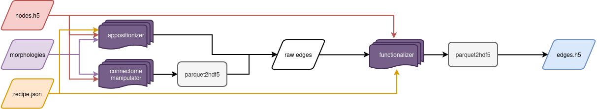

.. warning::
   The Blue Brain Project concluded in December 2024, so development has ceased under the BlueBrain GitHub organization.
   Future development will take place at: https://github.com/openbraininstitute/functionalizer

|license| |docs|

Functionalizer
==============

Functionalizer is a tool for filtering the output of a touch detector (the "touches")
according to morphological models, given in in the form of recipe prescription as
described in the `SONATA extension`_.

To process the large quantities of data optimally, this software uses PySpark.

Installation
------------

The easiest way to install `functionalizer` is via:

.. code-block:: console

   pip install functionalizer

Due to a dependency on ``mpi4py``, a MPI implementation needs to be installed on the
system used.  On Ubuntu, this can be achieved with:

.. code-block:: console

   apt-get install -y libopenmpi-dev

For manual installation from sources via ``pip``, a compiler handling C++17 will be
necessary.  Furthermore, all ``git`` submodules should be checked out:

.. code-block:: console

   gh repo clone BlueBrain/functionalizer -- --recursive --shallow-submodules
   cd functionalizer
   pip install .

Spark and Hadoop should be installed and set up as runtime dependencies.

Usage Overview
--------------

Functionalizer is an integral part of building a brain circuit.  It will take the
connectome as established by

- `appositionizer`_, in the form of detailed morphologies being in close proximity, or
- `connectome-manipulator`_, which will approximate connectivity following probabilistic
  rules,

and transform then in any of the following filtering steps:

- trim appositions according to simple touch rules
- trim appositions to follow biological distributions, parametrized in connection rules
- add synaptic properties to convert any apposition into a proper synapse

If the input format is binary from `appositionizer`_, one may use ``touch2parquet`` from
`parquet-converters`_ to convert into Parquet that may be read by Functionalizer.
All circuit inputs need to be defined in a ``circuit_config.json`` according to the
`SONATA extension`_, containing pointers to nodes in `nodes.h5` and morphologies.
A ``recipe.json``, defined in the same SONATA extension, is used to supply the parameters
needed for filters.

The output of Functionalizer should be converted to SONATA-conform HDF5 via ``parquet2hdf5``
from `parquet-converters`_.

CLI Usage
---------

Basic usage follows the pattern::

    functionalizer --s2f --circuit-config=circuit_config.json --recipe=recipe.json edges.h5

Where the final argument `edges.h5` may also be a directory of Parquet files.  When
running on a cluster with multiple nodes, care should be taken that every rank occupies a
whole node, Spark will then spread out across each node.

Acknowledgment
--------------
The development of this software was supported by funding to the Blue Brain Project,
a research center of the École polytechnique fédérale de Lausanne (EPFL),
from the Swiss government's ETH Board of the Swiss Federal Institutes of Technology.

Copyright (c) 2017-2024 Blue Brain Project/EPFL

.. _SONATA extension: https://sonata-extension.readthedocs.io
.. _appositionizer: https://github.com/BlueBrain/appositionizer
.. _connectome-manipulator: https://github.com/BlueBrain/connectome-manipulator
.. _parquet-converters: https://github.com/BlueBrain/parquet-converters

.. |license| image:: https://img.shields.io/pypi/l/functionalizer
                :target: https://github.com/BlueBrain/functionalizer/blob/master/LICENSE.txt

.. |docs| image:: https://readthedocs.org/projects/functionalizer/badge/?version=latest
             :target: https://functionalizer.readthedocs.io/
             :alt: documentation status
