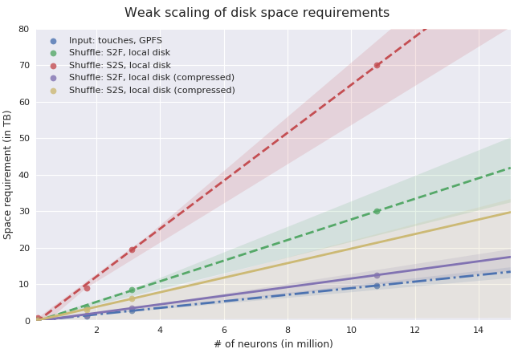

Running
=======

A couple of examples, both single node and using a cluster, can be found in
the examples directory in the source.

In the most simple case you just want to run Spykfunc from the command line, which will
apply the same filters as Functionalizer in one of three modi:

* **Structural** runs basic filtering only via
  :class:`~spykfunc.filters.BoutonDistanceFilter` and
  :class:`~spykfunc.filters.SynapseProperties`.

* **Functional** produces a circuit ready for simulation by the means of
  :class:`~spykfunc.filters.BoutonDistanceFilter`,
  :class:`~spykfunc.filters.TouchRulesFilter`,
  :class:`~spykfunc.filters.ReduceAndCut`, and
  :class:`~spykfunc.filters.SynapseProperties`.

* **Gap-Junctions** uses
  :class:`~spykfunc.filters.SomaDistance` and
  :class:`~spykfunc.filters.GapJunction` to produce a circuit based on gap
  junctions.

Custom lists of filters can be run with the ``--filters`` command line
option, separated only by commas (``,``).  Note that any trailing `Filter`
should be omitted from class names.

See the output of the help for detailed information:

.. code-block:: console

   $ module load spykfunc
   $ spykfunc -h
   usage: spykfunc [-h] (--s2s | --s2f | --gap-junctions | --filters FILTERS)
                   [--format-hdf5] [--name NAME] [--cache-dir CACHE_DIR]
                   [--checkpoint-dir CHECKPOINT_DIR] [--output-dir OUTPUT_DIR]
                   [-c CONFIGURATION] [-p OVERRIDES] [--dump-configuration]
                   [--overwrite [{F,E}]]
                   recipe_file circuit_file morpho_dir touch_files [touch_files ...]

   spykfunc is a pyspark implementation of functionalizer.

   positional arguments:
     recipe_file           the XML recipe file
     circuit_file          the input mvd file
     morpho_dir            the H5 morphology database directory
     touch_files           the touch files (parquets); a litertal blob expression
                           is also accepted.

   optional arguments:
     -h, --help            show this help message and exit
     --s2s, --structural   structural pruning only with filters:
                               BoutonDistance, SynapseProperties
     --s2f, --functional   functional pruning and filtering using:
                               BoutonDistance, TouchRules, ReduceAndCut,
                               SynapseReposition, SynapseProperties
     --gap-junctions       run filters for gap-junctions:
                               SomaDistance, GapJunction
     --filters FILTERS     run a list of custom filters (comma-separated),
                           available:
                               BoutonDistance, CumulativeDistance, GapJunction,
                               ReduceAndCut, SomaDistance, SynapseReposition,
                               SynapseProperties, TouchRules
     --format-hdf5         write/convert result to HDF5 (nrn.h5) rather than
                           parquet
     --name NAME           name that will show up in the Spark logs, defaults to
                           'Functionalizer'
     --cache-dir CACHE_DIR
                           specify directory to cache circuits converted to
                           parquet, defaults to OUTPUT_DIR/_circuits
     --checkpoint-dir CHECKPOINT_DIR
                           specify directory to store checkpoints, defaults to
                           OUTPUT_DIR/_checkpoints
     --output-dir OUTPUT_DIR
                           specify output directory, defaults to
                           ./spykfunc_output
     -c CONFIGURATION, --configuration CONFIGURATION
                           a configuration file to use; see `--dump-
                           configuration` for default settings
     -p OVERRIDES, --spark-property OVERRIDES
                           override single properties of the configuration, i.e.,
                               `--spark-property
                               spark.master=spark://1.2.3.4:7077`
                           may be specified multiple times.
     --dump-configuration  show the configuration including modifications via
                           options prior to this flag and exit
     --overwrite [{F,E}]   overwrite the result of selected intermediate steps,
                           forcing their recomputation; possible values: F (for
                           filtered, implies E) or E (for extended with synapse
                           properties)

Use the `--format-hdf5` flag to obtain output in HDF5. This is not
guaranteed to work with larger circuits.

Input Conversion
----------------

The touch files need to be in parquet. The module includes binaries to
convert the TouchDetector output:

.. code-block:: console

   $ touch2parquet
   usage: touch2parquet[_endian] <touch_file1 touch_file2 ...>
       touch2parquet [-h]
   $ ls
   touches.0 touchesData.0
   $ mkdir parquet; cd parquet
   $ touch2parquet ../touchesData.*
   [Info] Converting ../touchesData.0
   $ ls
   touchesData.0.parquet

For a quicker conversion, use an MPI-enabled version:

.. code-block:: console

   $ salloc -Aproj16 -pinteractive -t 8:00:00 -N1 -n42
   …some SLURM/shell output…
   $ srun --mpi=pmi2 touch2parquetp ../touchesData.0
   [Info] Converting ../touchesData.0
   $ ls
   touchesData.0.parquet   touchesData.1.parquet   touchesData.2.parquet   touchesData.3.parquet
   touchesData.10.parquet  touchesData.20.parquet  touchesData.30.parquet  touchesData.40.parquet
   touchesData.11.parquet  touchesData.21.parquet  touchesData.31.parquet  touchesData.41.parquet
   touchesData.12.parquet  touchesData.22.parquet  touchesData.32.parquet  touchesData.4.parquet
   touchesData.13.parquet  touchesData.23.parquet  touchesData.33.parquet  touchesData.5.parquet
   touchesData.14.parquet  touchesData.24.parquet  touchesData.34.parquet  touchesData.6.parquet
   touchesData.15.parquet  touchesData.25.parquet  touchesData.35.parquet  touchesData.7.parquet
   touchesData.16.parquet  touchesData.26.parquet  touchesData.36.parquet  touchesData.8.parquet
   touchesData.17.parquet  touchesData.27.parquet  touchesData.37.parquet  touchesData.9.parquet
   touchesData.18.parquet  touchesData.28.parquet  touchesData.38.parquet
   touchesData.19.parquet  touchesData.29.parquet  touchesData.39.parquet

Executing Spykfunc on the cluster
---------------------------------

For optimal performance, the Spark functionalizer should be run on a
cluster. Within a SLURM allocation, the following can be used to start up
both a Spark and a HDFS cluster:

.. code-block:: bash

   module load nix/hpc/spykfunc

   export CORES=36
   export CIRCUIT=/gpfs/bbp.cscs.ch/project/proj68/circuits/dev-11M/circuit.mvd3
   export MORPHOS=/gpfs/bbp.cscs.ch/project/proj59/entities/morphologies/2017.10.31/v1
   export RECIPE=/gpfs/bbp.cscs.ch/project/proj68/circuits/dev-11M/connectome/functional/recipe_patched/builderRecipeAllPathways.xml
   export TOUCHES=/gpfs/bbp.cscs.ch/project/proj68/circuits/dev-11M/connectome/touches/parquet/*.parquet

   export OUTDIR=/gpfs/bbp.cscs.ch/project/proj68/circuits/dev-11M/connectome/functional/output.n64
   mkdir -p $OUTDIR
   cd $OUTDIR
   sm_run -c $CORES \
           spykfunc --s2f \
                   --output-dir=$OUTDIR \
                   --checkpoint-dir=/use/hadoop/ \
                   --spark-property spark.master=spark://$(hostname):7077 \
                   $RECIPE $CIRCUIT $MORPHOS $TOUCHES

The `sm_run` command is a custom wrapper tuned to the BB5 environment, used
to start both the Spark and optional HDFS cluster.

Its behavior is determined mostly by environment variables or command line
flags.  E.g., the `-c` flag above is used to set the number of cores that
Spark will use.
By default, 18 cores are assigned to an executor, and the `-c` flag to
`sm_run` should be a multiple of 18.
To decrease the amount of cores, make sure that `-c` is a multiple of
the number `n` passed to `--spark-property spark.executor.cores=n`
simultaneously.

Similarly, `-m` can be used to restrict the memory that
Spark, and thus the Spark functionalizer, will use.
The corresponding setting for Spykfunc is `--spark-property
spark.executor.memory=…`.

By default, `sm_run` will start an HDFS cluster to save the execution
state and coerce Spark to break the execution chain.
For larger circuits, i.e., more than 2 million neurons, the runtime will be
shortened dramatically compared to storing the checkpoints/execution state
on GPFS.
The HDFS cluster can be disabled by passing `-H` to `sm_run`.

.. note::

   By default, `sm_run` will store cluster data, such as logs and temporary
   configurations, in a directory `_cluster` where it is executed. The user
   is responsible for removing this directory after a possible analysis of
   the execution.

The following shows all options to run a Spark cluster, and can also be
obtained by executing `sm_run` without any arguments:

.. code::

   usage: sm_run [-c SM_WORKER_CORES] [-m SM_WORKER_MEMORY] [-H|-h HADOOP_HOME] [-w WORKDIR] [-e ENVIRONMENT] COMMAND ARGS…
          sm_startup WORKDIR [ENVIRONMENT]
          sm_shutdown

   special options:
     -H   Disabe HADOOP support.

   positional arguments:
     WORKDIR       Working directory to use. Defaults to ./_cluster.
     ENVIRONMENT   Script to source to obtain the right environment.
                   Will be automatically looked for in $WORKDIR, $SPARK_CONF_DIR, $SPARK_HOME.

   environment variables to configure behavior:
     HADOOP_HOME           If set, will spawn a HADOOP cluster.

     SM_MASTER_MEMORY      Memory to dedicate to the master. Will be
                           subtracted from the detected machine memory when
                           calculating the memory allocation for workers.

                           Can be set by the user, and is specified in MB.
                           Defaults to 4096.

     SM_WORKDIR            The WORKDIR exported and accessible to the
                           ENVIRONMENT script.

     SM_WORKER_CORES       Cores to allot to a worker.

     SM_WORKER_MEMORY      Memory to allot to a worker.

     SM_WORKER_COUNT       Limit number of workers.

     SM_HADOOP_COUNT       Limit number of Hadoop name nodes.

     SM_EXECUTE            Command to execute once the cluster has started.

     SM_VERBOSE            Print all commands before executing them, via .

SLURM Allocation Size
----------------------

To be able to estimate the size of a SLURM allocation on BB5, the following
graph may be of use:

   Disk space needed for shuffle data as of summer 2018.

Since the nodes in UC4 each have 2TB of local SSD space available, and
compression is enabled by default, the shuffle data alone will require
about 10 nodes when functionalizing 11 million neurons (S2S, compressed).
It is recommended to allow for additional space due to the checkpoints that
Spykfunc will save during the execution, maybe 3-5 times the size of the
input data (drawn dash-dotted), here 32 nodes should suffice to
successfully functionalize 11 million neurons.

Output Conversion
-----------------

Within an allocation, the following command will convert all parquet files
present in the Spykfunc output directory, and convert them to a `circuit.syn2`
file:

.. code-block:: console

   $ salloc -Aproj16 -pinteractive -t 8:00:00 -N1 -n42
   …some SLURM/shell output…
   $ srun --mpi=pmi2 parquet2syn2p circuit.parquet/*.parquet
